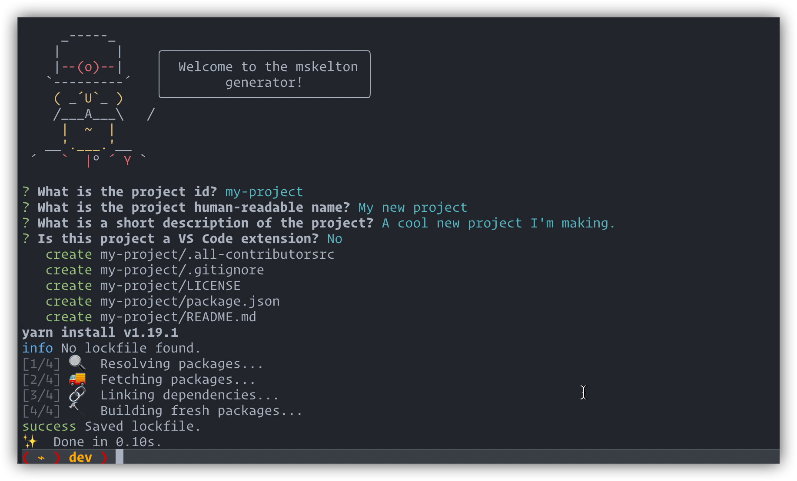

# Yeoman Generator mskelton

[](https://github.com/mskelton/generator-mskelton/actions)
[](#contributors)

> Yeoman generator for my projects.



## Installation

First, install [Yeoman](http://yeoman.io) and generator-mskelton.

```sh
# Yarn
yarn global add yo
yarn global add generator-mskelton

# npm
npm install -g yo
npm install -g generator-mskelton
```

## Usage

```sh
yo mskelton
```

In addition to the base mskelton generator, this package also includes a generator for creating GitHub repositories. To use this generator, first ensure that you have a `GITHUB_TOKEN` exported in your shell. This token can be created on your GitHub user settings and should have the `public_repo` OAuth scope.

Once you have exported the `GITHUB_TOKEN` environment variable, run the following command to run the repo generator.

```sh
yarn mskelton:repo
```

## Contributors ✨

<!-- ALL-CONTRIBUTORS-LIST:START - Do not remove or modify this section -->
<!-- prettier-ignore-start -->
<!-- markdownlint-disable -->
<table>
  <tr>
    <td align="center"><a href="https://github.com/mskelton"><br /><sub><b>Mark Skelton</b></sub></a><br /><a href="https://github.com/mskelton/generator-mskelton/commits?author=mskelton" title="Code">💻</a> <a href="https://github.com/mskelton/generator-mskelton/commits?author=mskelton" title="Documentation">📖</a></td>
  </tr>
</table>

<!-- markdownlint-enable -->
<!-- prettier-ignore-end -->

<!-- ALL-CONTRIBUTORS-LIST:END -->

This project follows the [all-contributors](https://github.com/all-contributors/all-contributors) specification. Contributions of any kind welcome!
